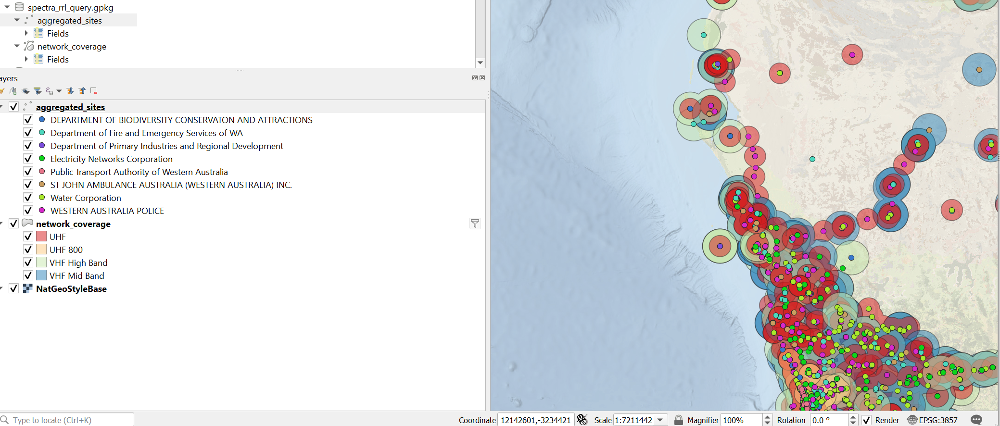

# acma-rrl-gpkg
Convert the acma data dumped daily from https://www.acma.gov.au/radiocomms-licence-data into a geopackage with some convenience views.

## Requirements
Python3 and local ogr2ogr binary (The [GDAL Docker Images](https://github.com/OSGeo/gdal/tree/master/docker) have both installed by default)

## Usage
Files will be saved to the current directory

```bash
git clone https://github.com/adonm/acma-rrl-gpkg.git
cd acma-rrl-gpkg
python3 downloadacmadata.py
```

There will be 2 outputs, `spectra_rrl.gpkg` including the raw data and `spectra_rrl_query.gpkg` which is the output of queries from `spectra_rrl_query.vrt`. To refresh data, just delete the output file you would like to refresh and the `downloadacmadata.py` script will refresh it.

You can open the `coverageoverview.qgs` file in [QGIS](https://docs.qgis.org/3.22/en/docs/user_manual/introduction/getting_started.html#installing-from-binaries) a very powerful desktop GIS tool (all the work with ogr2ogr above was done using the `OSGeo4W Shell` included with QGIS). Then you can interrogate and export data from the generate geopackages.

## Screenshots

